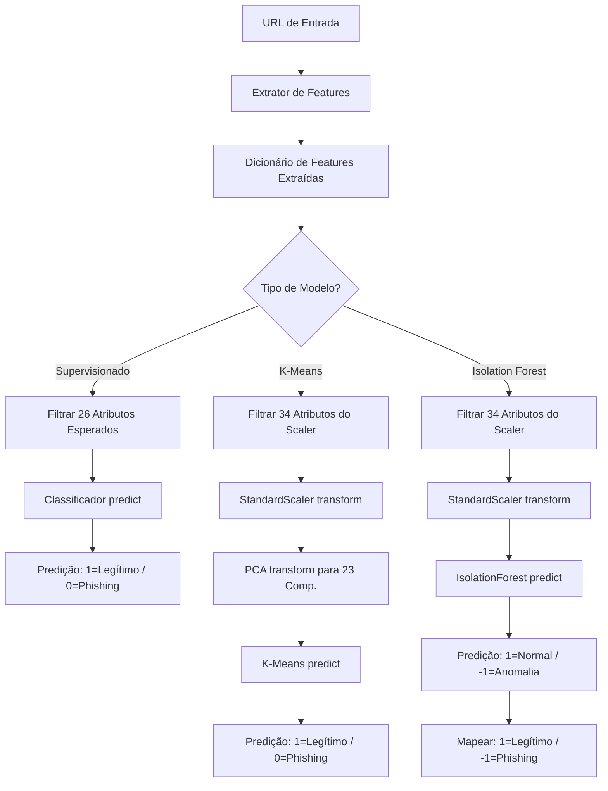

# Modelos de Machine Learning & Integração 🧠

Este diretório contém os artefatos de Machine Learning serializados (`.pkl`) gerados a partir do treinamento nos notebooks do projeto. Eles são expostos diretamente ao container do back-end FastAPI para servir predições em tempo real na interface web.

---

## 📁 Estrutura dos Arquivos de ML

Os arquivos estão organizados de acordo com os estimadores e as abordagens (Supervisionada vs. Não-Supervisionada):

```
ml_pipeline/
├── arvore-de-decisao/
│   ├── dt_base_sl.pkl       # Dicionário contendo a Árvore de Decisão Base
│   └── dt_results_sl.pkl    # Dicionário contendo a Árvore de Decisão Otimizada (Grid Search)
├── xgboost/
│   ├── xgb_base_sl.pkl      # Dicionário contendo o XGBoost Base
│   └── xgb_results_sl.pkl   # Dicionário contendo o XGBoost Otimizado (Grid Search)
└── nao-supervisionados/
    ├── scaler_35.pkl        # Normalizador StandardScaler treinado com 34 atributos do Dataset 35
    ├── pca_35.pkl           # Redutor de dimensionalidade PCA (23 componentes principais)
    ├── kmeans_35.pkl        # Modelo K-Means treinado com 2 clusters
    └── isolation_forest_35.pkl # Modelo Isolation Forest treinado diretamente sobre os 34 atributos
```

> [!NOTE]
> Os arquivos `.pkl` supervisionados são dicionários salvos via `joblib`. Para obter o modelo classificador de fato, o back-end acessa a chave `df_35` (conjunto reduzido a 35 colunas do PhiUSIIL) e recupera a chave correspondente:
> - `estimator`: Para o modelo base.
> - `best_estimator`: Para o modelo otimizado (Grid Search).

---

## ⚙️ Preprocessamento & Fluxo de Integração

O extrator de features do back-end extrai dinamicamente mais de 50 features de qualquer URL informada. Porém, cada modelo de IA foi treinado em uma versão filtrada de atributos. A lógica de compatibilidade é gerenciada de forma centralizada pelo back-end:



### 1. Modelos Supervisionados (Árvores e Boosting)
Estes modelos esperam exatamente **26 atributos** de entrada (derivados da seleção do dataset `df_35` de PhiUSIIL).
- **Entrada**: DataFrame contendo as 26 colunas na ordem exata definida em `model.feature_names_in_`.
- **Saída**: Rótulo direto `1` para Legítimo e `0` para Phishing.

### 2. K-Means (Não-Supervisionado)
O K-Means depende da redução geométrica feita pelo PCA.
1. **Passo 1**: Filtra os 34 atributos esperados pelo `scaler_35.pkl`.
2. **Passo 2**: Normaliza as features usando `scaler.transform()`.
3. **Passo 3**: Reduz a dimensionalidade para **23 componentes principais** usando `pca.transform()`.
4. **Passo 4**: Prediz o cluster usando `kmeans.predict()`.
- **Saída**: Rótulo direto do cluster, onde `1` corresponde ao agrupamento de URLs Legítimas e `0` a URLs de Phishing.

### 3. Isolation Forest (Não-Supervisionado / Anomalias)
A Isolation Forest não se beneficia do PCA (como detalhado nos notebooks, a redução de dimensionalidade prejudica a capacidade do modelo de isolar outliers).
1. **Passo 1**: Filtra os 34 atributos esperados pelo `scaler_35.pkl`.
2. **Passo 2**: Normaliza as features usando `scaler.transform()`.
3. **Passo 3**: Executa a predição diretamente no modelo `isolation_forest.predict()`.
- **Saída**: Retorna `1` para inliers (dados normais, mapeados como **Legítimo**) e `-1` para outliers (anomalias, mapeados como **Phishing**).

---

## 📊 Tipo de Atributos Utilizados

Os 34 atributos selecionados para o pipeline combinam informações extraídas da estrutura textual da URL (**Lexicais**) e do comportamento e marcações do site (**Conteúdo HTML**):

| Categoria | Nome do Atributo | Descrição |
| :--- | :--- | :--- |
| **Lexical** | `URLLength` | Comprimento total da URL (normalizado para `http://`). |
| **Lexical** | `DomainLength` | Comprimento completo do hostname (ex: `www.exemplo.com.br`). |
| **Lexical** | `CharContinuationRate` | Razão de caracteres contínuos (não pontuados). |
| **Lexical** | `NoOfLettersInURL` | Número total de letras na URL (excluindo protocolo). |
| **Lexical** | `LetterRatioInURL` | Razão de letras presentes na URL. |
| **Lexical** | `NoOfDegitsInURL` | Número total de números/dígitos na URL. |
| **Lexical** | `DegitRatioInURL` | Razão de números presentes na URL. |
| **Lexical** | `NoOfQMarkInURL` | Quantidade de pontos de interrogação (`?`). |
| **Lexical** | `NoOfOtherSpecialCharsInURL` | Quantidade de outros caracteres especiais (exceto `=`, `?`, `&`). |
| **Lexical** | `SpacialCharRatioInURL` | Razão de outros caracteres especiais. |
| **Lexical** | `IsHTTPS` | Sinalizador se a URL original foi acessada via HTTPS. |
| **Lexical** | `Bank` | Flag indicando se a palavra "bank" está contida na URL. |
| **Lexical** | `Pay` | Flag indicando se a palavra "pay" está contida na URL. |
| **Conteúdo** | `LineOfCode` | Total de linhas no código-fonte da página HTML. |
| **Conteúdo** | `LargestLineLength` | Comprimento da maior linha única encontrada no HTML. |
| **Conteúdo** | `HasTitle` | Flag indicando se a página possui uma tag `<title>`. |
| **Conteúdo** | `HasFavicon` | Presença de favicon customizado na página. |
| **Conteúdo** | `Robots` | Sinaliza se a página especifica regras para web crawlers. |
| **Conteúdo** | `IsResponsive` | Presença da tag viewport (responsividade do layout). |
| **Conteúdo** | `HasDescription` | Presença de meta tag description de SEO. |
| **Conteúdo** | `NoOfPopup` | Contagem de chamadas a popups dinâmicos via JavaScript. |
| **Conteúdo** | `NoOfiFrame` | Quantidade de tags `<iframe>` incorporadas na tela. |
| **Conteúdo** | `HasExternalFormSubmit` | Flag de formulários apontando para domínios de envio externos. |
| **Conteúdo** | `HasSubmitButton` | Presença de botões de submissão do formulário. |
| **Conteúdo** | `HasHiddenFields` | Presença de inputs ocultos (comumente usados para rastreamento). |
| **Conteúdo** | `HasPasswordField` | Presença de inputs para inserção de senhas. |
| **Conteúdo** | `HasCopyrightInfo` | Presença de símbolos de Copyright (©) ou termos de marca registrada. |
| **Conteúdo** | `NoOfImage` | Quantidade total de imagens renderizadas. |
| **Conteúdo** | `NoOfCSS` | Links de folhas de estilo CSS externas ou internas. |
| **Conteúdo** | `NoOfJS` | Scripts JavaScript acoplados ao HTML. |
| **Conteúdo** | `NoOfSelfRef` | Contagem de links internos (apontando para o próprio domínio). |
| **Conteúdo** | `NoOfEmptyRef` | Contagem de links vazios (âncoras `#` ou links sem href). |
| **Conteúdo** | `NoOfExternalRef` | Contagem de links que apontam para domínios de terceiros. |
